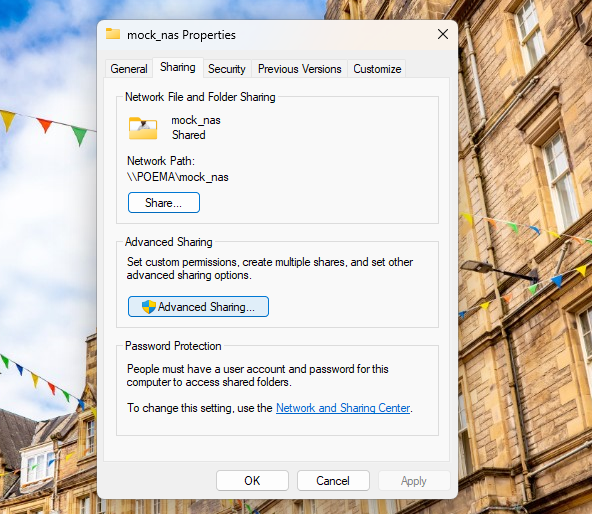
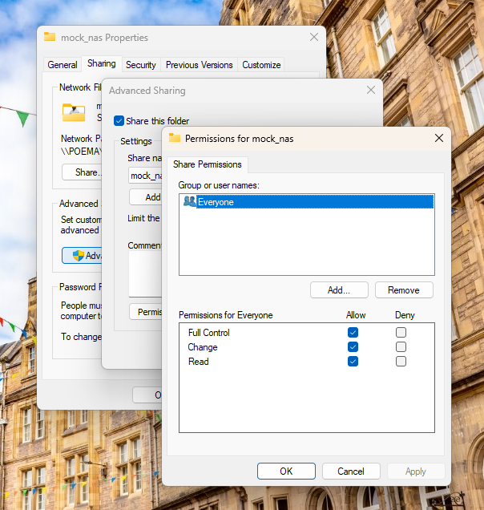
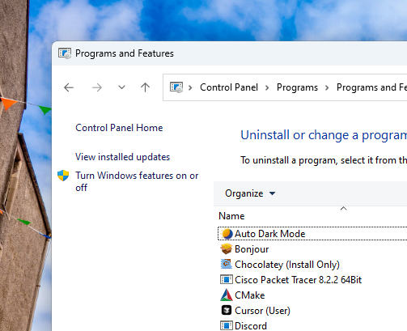
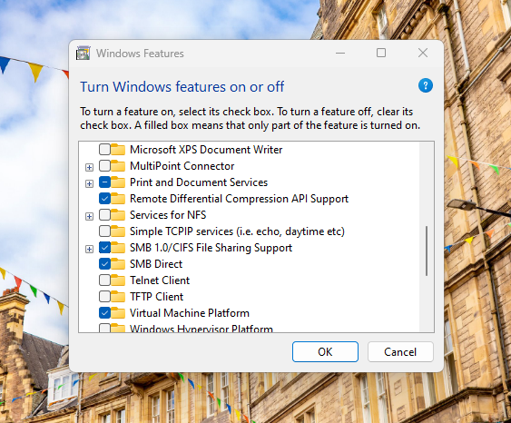
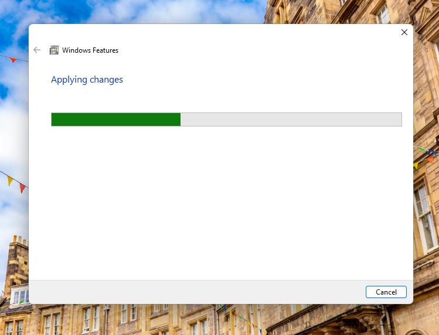

# How to Create a Local SMB Share on Windows

This guide walks you through creating a mock NAS drive using a shared folder on Windows. This is helpful for local SMB file access testing.

---

## Step 1: Create a Folder

1. Open File Explorer.
2. Create a folder, e.g., `C:\mock_nas`.
3. Add media files (images/videos) if desired.

---

## Step 2: Share the Folder Over the Network

1. Right-click the folder → **Properties**
2. Navigate to **Sharing** tab → click **Advanced Sharing...**

   

3. Check **Share this folder**
4. Click **Permissions**:
   - Select **Everyone**
   - Grant **Read** or **Full Control**

   

5. Click **OK** on all dialogs to confirm.

---

## Step 3: Verify the Shared Path

1. In the **Sharing** tab, note the **Network Path**, e.g., `\\YOUR-COMPUTER\mock_nas`
2. To test access:
   - Press `Win + R`, enter `\\YOUR-COMPUTER\mock_nas`
   - Press Enter → folder should open

---

## Step 4: Enable SMB Support (If Needed)

1. Go to **Control Panel** → **Programs and Features**
2. Click **Turn Windows features on or off**

   

3. Check **SMB 1.0/CIFS File Sharing Support**

   

4. Click **OK**
5. Wait for changes to apply → restart if prompted

   

---

## Step 5: Find Your Local IP Address

1. Open **Command Prompt**
2. Run:

   ```bash
   ipconfig
   ```

3. Find your IPv4 Address, e.g., 192.168.1.100

You can now access your share via:
`\\<your-ip-address>\mock_nas`
